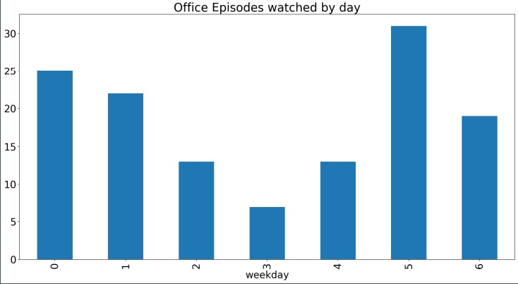
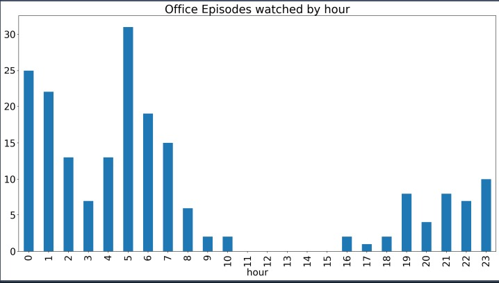

# Play_with_data_python

I used the libraries:

 *panda - clean, filter and anylize data
 *matplotlib - create bar, charts to view patterns

The code is written in anaconda - spider.

This project processes data from Netflix viewing csv using python. It analyzez personal data to explore The Office U.S. watching habits, such as:
 * cleaning the data by removing unnecessary columns - !not recommended for large scale projects
 * filters data to include only The Office U.S. episodes watched for more than 1 minute - to exclude previews/trailers
 * converts Start Time and Duration for the library panda to understand and perform calculations
 * analyze data - how much did i watch The Office U.S., when did i watch The Office U.S. - on which days and which hours + use plot
 * also analyze most/least watched episode in The Office

Results:

Plot for episodes watched by day

Plot for episodes watched by hour

Result for most and least watched episode(s)

.jpg)
